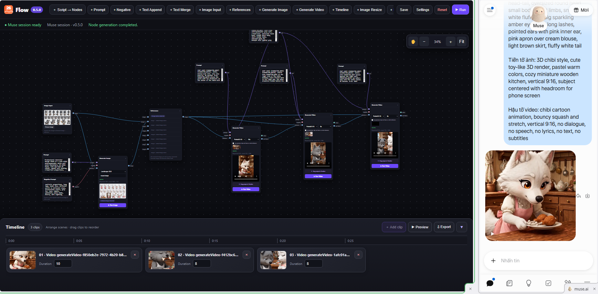
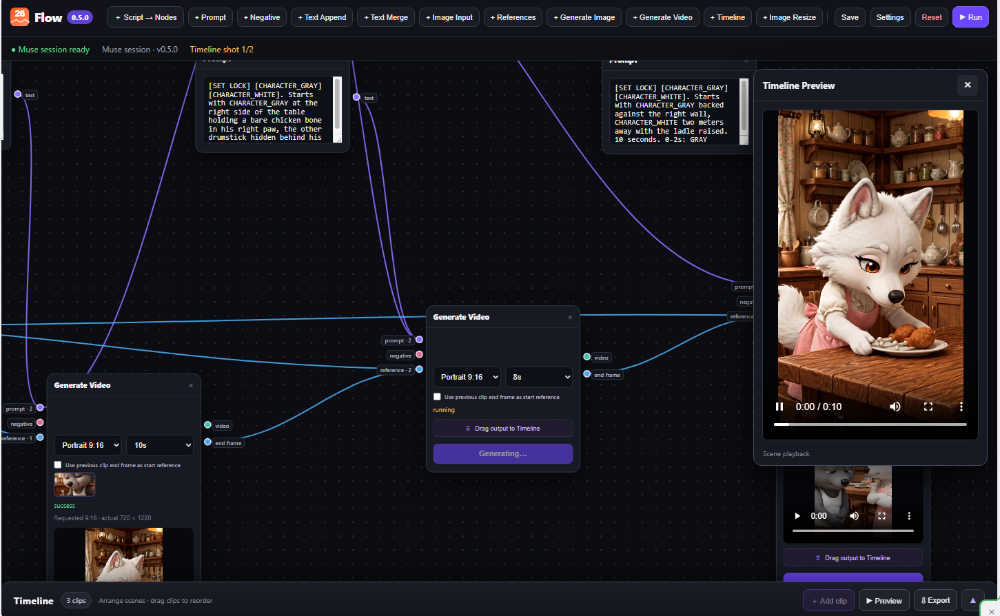
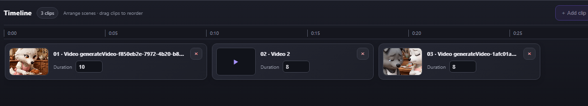

# 26Flow

[English](README.md)

**26Flow** là tiện ích mở rộng tạo quy trình trực quan bằng phiên Muse.ai bạn đã đăng nhập. Bạn có thể nối các node trên canvas, tạo ảnh/video và sắp xếp clip video trên timeline.

## Ảnh giao diện

### Canvas workflow và Muse.ai

### Xem trước timeline

### Chỉnh sửa timeline

### Video demo

[▶ Xem trên YouTube](https://www.youtube.com/watch?v=w7mJwTJyzKw) · [Tải video demo MP4](https://github.com/bynne2602/museflow/releases/download/demo-2026-10-09/2026-10-09.11-17-18.mp4)

### Tính năng

- **Canvas node:** thêm, di chuyển, nối, chọn nhiều và sắp xếp node; phóng to/thu nhỏ, kéo canvas và mở thao tác bằng menu chuột phải.
- **Công cụ prompt:** tạo prompt, negative prompt, nối thêm hoặc gộp văn bản; hỗ trợ nối nhiều nguồn prompt ở các cổng phù hợp.
- **Quy trình ảnh:** đưa ảnh vào, kết nối nhiều ảnh tham chiếu, tạo ảnh, đổi kích thước và xem trước kết quả.
- **Quy trình video:** tạo clip, tùy chọn dùng frame cuối của clip trước làm ảnh tham chiếu mở đầu để giữ tính liên tục.
- **Timeline:** thêm và sắp xếp clip, đặt thời lượng, xem trước chuỗi clip và xuất video đã ghép định dạng WebM nếu trình duyệt hỗ trợ.
- **Script → Nodes:** chuyển kịch bản chia cảnh thành các node ảnh/video đã nối và timeline theo thứ tự.
- **Tệp workflow:** chọn **Save workflow** để tải workflow dạng JSON có thể dùng lại, rồi chọn **Import workflow** để mở lại. Media đầu vào và media đã tạo sẽ được nhúng nếu có thể; media từ xa không truy cập được sẽ giữ liên kết gốc.
- **Tự lưu cục bộ:** nút **Save** và tự động lưu giữ workflow hiện tại trong bộ nhớ extension trên trình duyệt.

### Yêu cầu

- Trình duyệt nền Chromium có hỗ trợ extension Manifest V3.
- Đăng nhập Muse.ai và mở trang chat Muse.ai trong lúc tạo nội dung.
- Tài khoản và giao diện Muse.ai cần hỗ trợ chức năng bạn muốn dùng. Tỷ lệ ảnh, âm thanh và khả năng tạo video phụ thuộc vào Muse.ai.

26Flow kết nối Muse.ai thông qua page bridge của extension. Ứng dụng không dùng muse2api, backend tạo nội dung riêng, API key, Docker hay bước build bằng npm. Khi chạy workflow, prompt và ảnh tham chiếu đã chọn sẽ được gửi tới Muse.ai.

### Cài đặt

1. Tải hoặc clone repository này và giải nén vào một thư mục cố định.
2. Mở trang quản lý extension của trình duyệt (Chrome: `chrome://extensions`).
3. Bật **Developer mode (Chế độ nhà phát triển)**.
4. Chọn **Load unpacked (Tải tiện ích đã giải nén)** và trỏ tới thư mục có file `manifest.json`.
5. Mở Muse.ai, đăng nhập và vào trang chat.
6. Mở **26Flow** và kiểm tra trạng thái phiên Muse.

#### Cập nhật

Thay các file dự án bằng phiên bản mới, sau đó nhấn **Reload (Tải lại)** ở trang quản lý extension. Tải lại cả tab Muse.ai để cập nhật bridge của extension.

### Bắt đầu nhanh

1. Thêm node **Prompt** và nhập nội dung.
2. Thêm node **Generate Image** hoặc **Generate Video**.
3. Kéo cổng output của Prompt sang cổng prompt của node tạo ảnh/video. Nối thêm ảnh tham chiếu hoặc input khác nếu cần.
4. Chọn thông số và nhấn **Run Image** hoặc **Run Video** trên node, hoặc chạy toàn workflow từ thanh công cụ.
5. Nối kết quả tới node **Preview**. Với video, thêm các clip vào **Timeline**, sắp xếp thứ tự rồi xem trước hoặc xuất video.

Để tạo node từ kịch bản, chọn **Script → Nodes**, dán nội dung và tạo workflow. Tiêu đề cảnh có thể theo dạng `CẢNH 1 (0:00–0:07): Tên cảnh`, cùng các trường `Prompt ảnh`, `Prompt video` và `Audio` nếu có.

### Dữ liệu và quyền truy cập

Workflow và media lưu cục bộ được giữ trong bộ nhớ extension trên thiết bị. Khi chạy workflow, 26Flow gửi prompt và ảnh tham chiếu liên quan tới Muse.ai thông qua phiên bạn đã đăng nhập. Extension cần quyền lưu trữ và truy cập tab để lưu workflow, kết nối với Muse.ai; extension không tạo tài khoản 26Flow hay máy chủ sinh nội dung riêng.

### Khắc phục sự cố

- **Không nhận phiên Muse:** đăng nhập Muse.ai, giữ trang chat đang mở, sau đó tải lại 26Flow và tab Muse.ai.
- **Không bắt đầu tạo hoặc không thấy media:** kiểm tra trang và phiên Muse.ai rồi thử lại. Muse.ai có thể thay đổi giao diện hoặc luồng tạo nội dung, khi đó extension cần được cập nhật.
- **Muse từ chối tạo cảnh:** 26Flow nhận diện lời từ chối, kể cả phản hồi tiếng Việt báo không tạo được hoặc đề nghị tạo bản tương đương, rồi tự thử lại cảnh đó một lần bằng prompt thay thế an toàn gần nhất. Không cần chờ xác nhận. Lần thử lại giữ vai trò của cảnh trong kịch bản và các thiết lập; Muse.ai vẫn quyết định nội dung có được tạo hay không.
- **Không xuất được timeline:** dùng trình duyệt có hỗ trợ `MediaRecorder` và canvas capture. Định dạng xuất là WebM.
- **Kết quả không đúng thông số:** Muse.ai quyết định media đầu ra; dịch vụ có thể không luôn làm theo tỷ lệ ảnh, âm thanh hoặc tùy chọn video được yêu cầu.

### Giấy phép

Phân phối theo [giấy phép MIT](LICENSE). Bản quyền (c) 2026 26Flow contributors.
